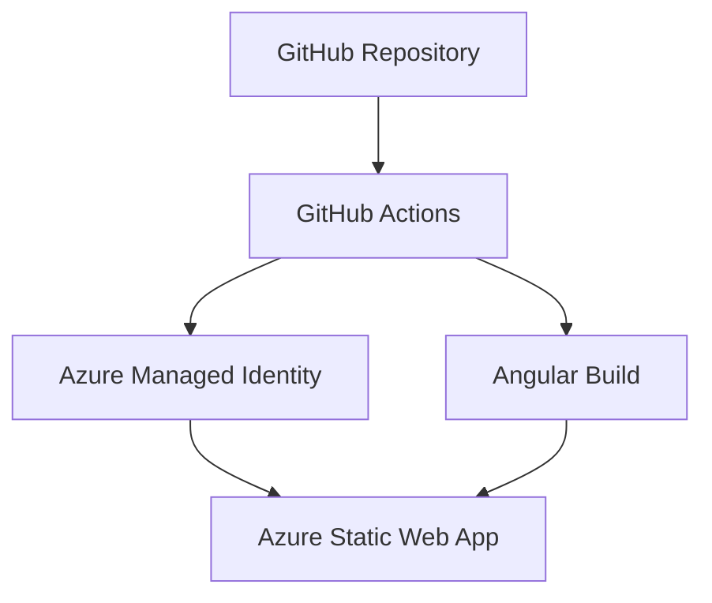

# BookRecommender Proto - Infrastructure Setup

This directory contains infrastructure scripts to deploy the BookRecommender Proto Angular UI to Azure Static Web Apps using GitHub Actions and managed identity authentication.

## 🏗️ Architecture Overview



## 📋 Prerequisites

Before running the setup scripts, ensure you have:

- **Azure CLI** installed and logged in (`az login`)
- **GitHub CLI** installed and logged in (`gh auth login`) 
- **jq** installed for JSON processing
- **Azure subscription** with contributor access
- **GitHub repository** access with secrets management permissions

## 🚀 Quick Start

### 1. Setup Azure Infrastructure

```powershell
cd BookRecommender_proto/infra/scripts
.\Setup-Azure.ps1
```

This creates:
- ✅ Azure Resource Group: `rg-bookrecommender-proto`
- ✅ Managed Identity: `id-bookrecommender-github`  
- ✅ OIDC federation for GitHub Actions
- ✅ Configuration file with all details

### 2. Create GitHub Secrets

```powershell
.\Setup-GitHubSecrets.ps1
```

This automatically creates GitHub secrets:
- ✅ `BOOKRECOMMENDER_PROTO_AZURE_CLIENT_ID`
- ✅ `BOOKRECOMMENDER_PROTO_AZURE_TENANT_ID`
- ✅ `BOOKRECOMMENDER_PROTO_AZURE_SUBSCRIPTION_ID`
- ✅ `BOOKRECOMMENDER_PROTO_AZURE_RESOURCE_GROUP`

### 3. Manual Step: Create Azure Static Web App API Token

**⚠️ Important:** One secret must be created manually after the Static Web App is created:

1. Go to [Azure Portal](https://portal.azure.com)
2. Navigate to your Static Web App (will be created by first workflow run)
3. Go to **Settings** > **Configuration**
4. Copy the **API Token**
5. Add it as GitHub secret: `AZURE_STATIC_WEB_APPS_API_TOKEN`

```powershell
# Add the API token manually
gh secret set AZURE_STATIC_WEB_APPS_API_TOKEN -R kiki-sen/proto
```

### 4. Deploy

Push changes to trigger the deployment:

```powershell
git add .
git commit -m "Add Azure infrastructure and deployment"
git push
```

## 📁 Directory Structure

```
infra/
├── scripts/
│   ├── Setup-Azure.ps1          # Create Azure resources
│   ├── Setup-GitHubSecrets.ps1  # Create GitHub secrets
│   └── Teardown-Azure.ps1       # Delete all resources
├── config/
│   └── azure-config.json        # Generated configuration
└── README.md                    # This file
```

## 🔧 Configuration

### Azure Resources

| Resource | Name | Purpose |
|----------|------|---------|
| Resource Group | `rg-bookrecommender-proto` | Container for all resources |
| Managed Identity | `id-bookrecommender-github` | OIDC authentication for GitHub |
| Static Web App | `swa-bookrecommender-ui` | Hosts the Angular application |

### GitHub Secrets

| Secret Name | Description |
|-------------|-------------|
| `BOOKRECOMMENDER_PROTO_AZURE_CLIENT_ID` | Managed Identity Client ID |
| `BOOKRECOMMENDER_PROTO_AZURE_TENANT_ID` | Azure AD Tenant ID |
| `BOOKRECOMMENDER_PROTO_AZURE_SUBSCRIPTION_ID` | Azure Subscription ID |
| `BOOKRECOMMENDER_PROTO_AZURE_RESOURCE_GROUP` | Resource Group Name |
| `AZURE_STATIC_WEB_APPS_API_TOKEN` | Static Web Apps deployment token |

## 🔄 Deployment Workflow

The GitHub Actions workflow (`bookrecommender-proto-ui.yml`) performs:

1. **Build & Test** - Runs on Node.js 20.x and 22.x
2. **Deploy to Azure** - Only on main branch push
3. **Artifact Upload** - Stores build files for 30 days

### Workflow Triggers

- ✅ Push to `main` or `master` branch
- ✅ Changes in `BookRecommender_proto/ui/**`
- ✅ Changes in `BookRecommender_proto/infra/**`
- ✅ Manual dispatch via GitHub UI

## 🗑️ Cleanup

To remove all Azure resources:

```powershell
.\Teardown-Azure.ps1
```

**Warning:** This permanently deletes all resources. Type `DELETE` to confirm.

## 🔍 Troubleshooting

### Common Issues

**Issue:** Workflow fails with authentication error
**Solution:** Verify GitHub secrets are correctly set and managed identity has proper permissions

**Issue:** Static Web App not found
**Solution:** The Static Web App is created automatically on first deployment. Ensure the workflow runs successfully first.

**Issue:** Build fails with Node.js version error
**Solution:** Angular CLI requires Node.js 20.19+ or 22.12+. The workflow uses supported versions.

### Verification Commands

```powershell
# Check Azure resources
az resource list -g rg-bookrecommender-proto --output table

# Check GitHub secrets
gh secret list -R kiki-sen/proto

# Check workflow runs
gh run list --workflow=bookrecommender-proto-ui.yml
```

## 📚 Additional Resources

- [Azure Static Web Apps Documentation](https://docs.microsoft.com/en-us/azure/static-web-apps/)
- [GitHub Actions for Azure](https://github.com/Azure/actions)
- [Azure CLI Reference](https://docs.microsoft.com/en-us/cli/azure/)
- [GitHub CLI Documentation](https://cli.github.com/)

## 🤝 Support

For issues with this infrastructure setup, check:
1. Azure Portal for resource status
2. GitHub Actions logs for deployment issues  
3. Azure Static Web Apps logs for runtime issues

---

**Built with ❤️ for BookRecommender Proto**
